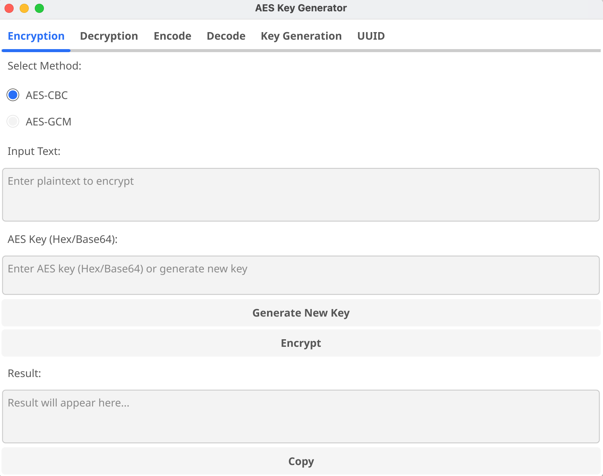
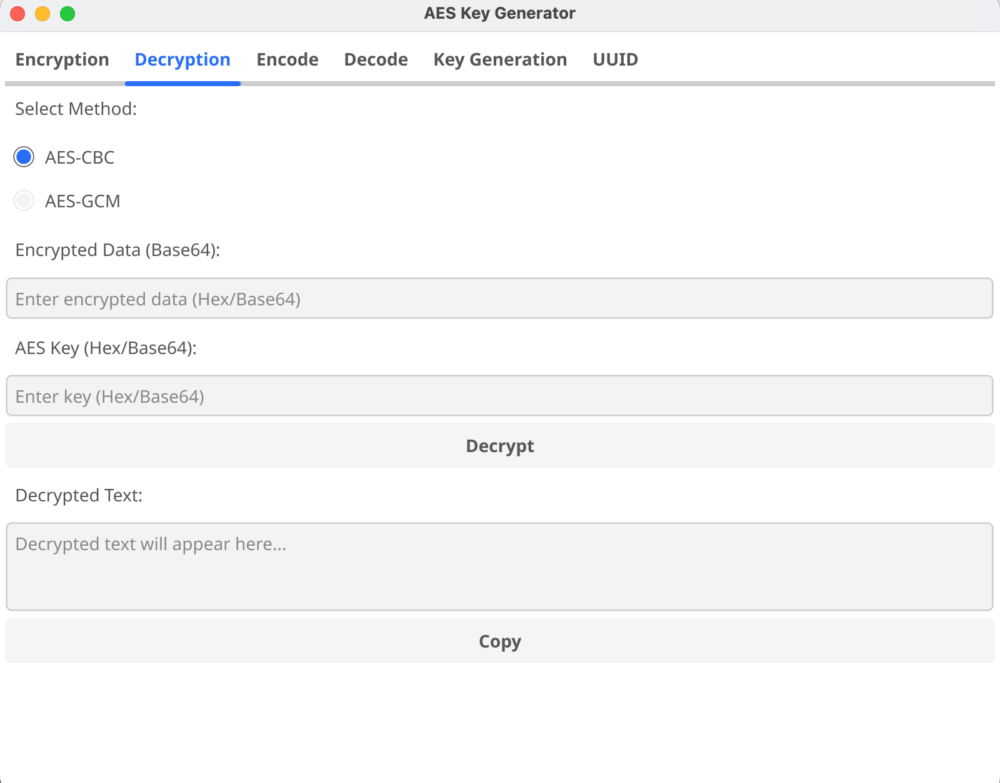
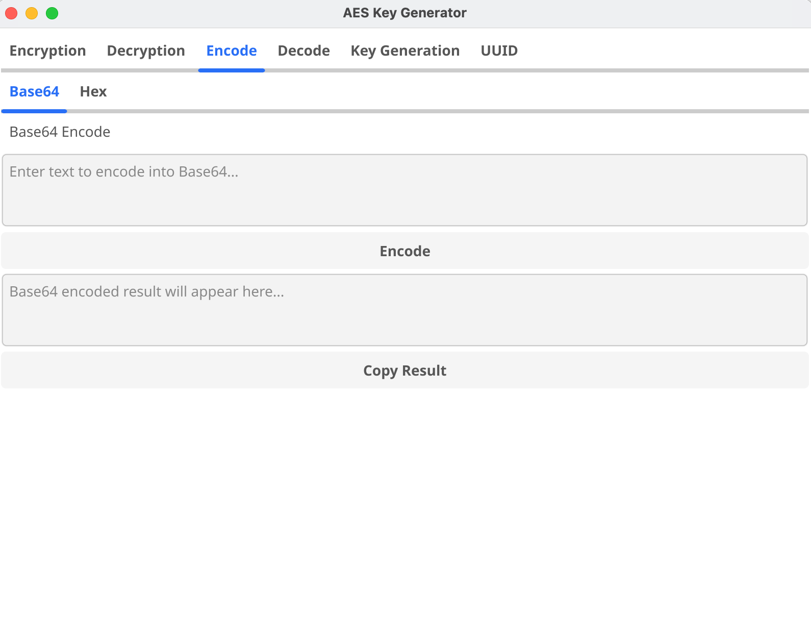
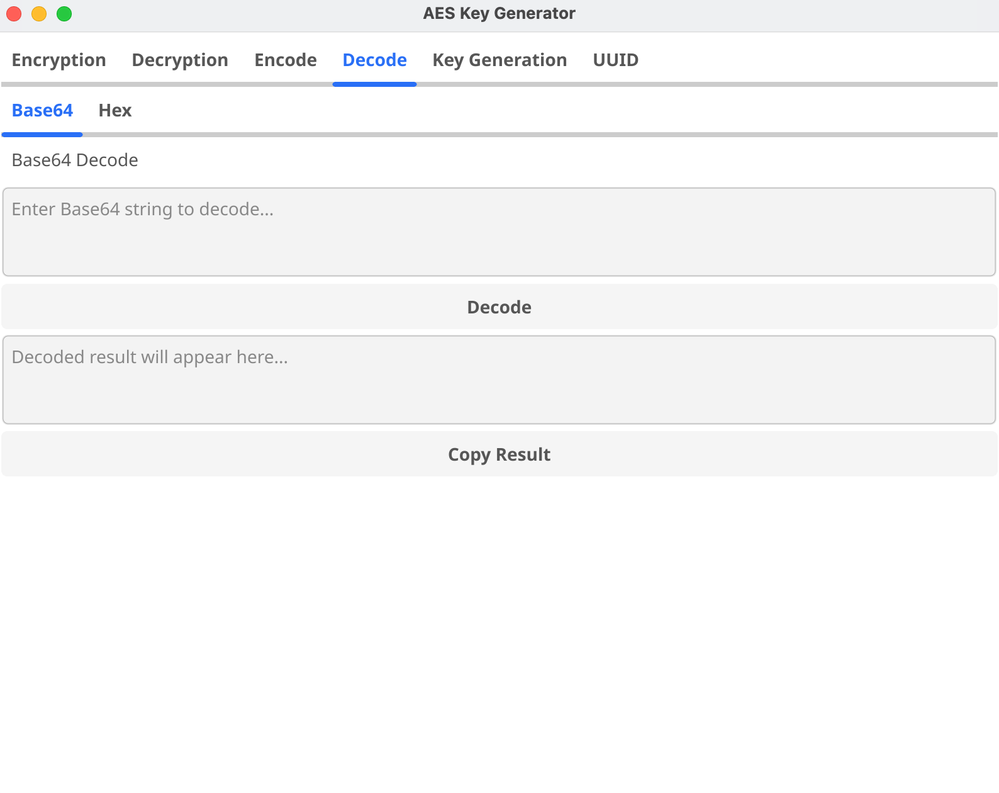
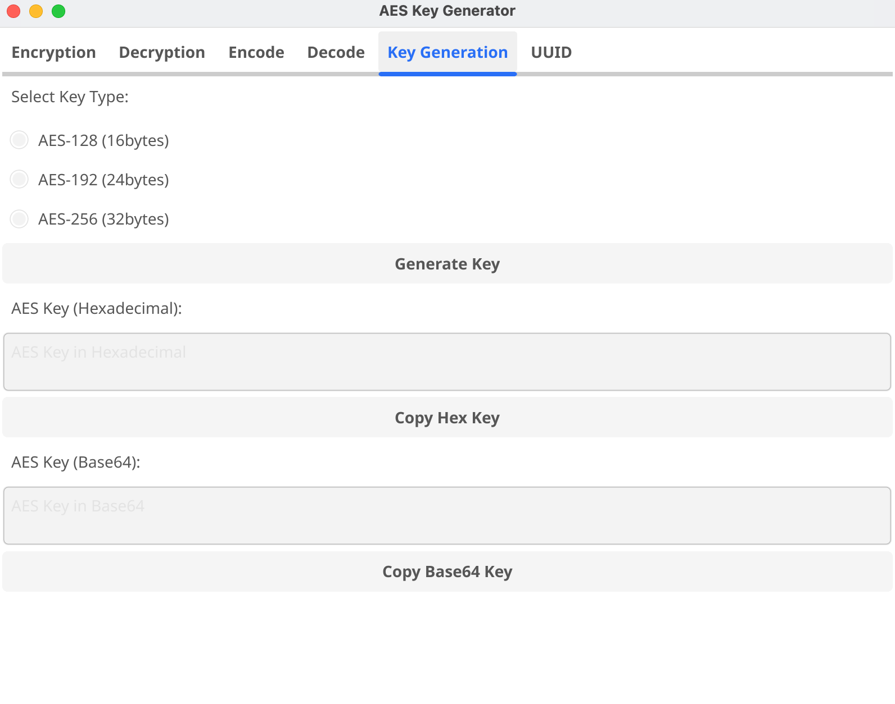
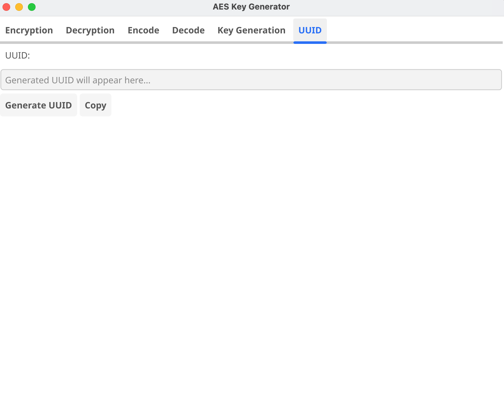
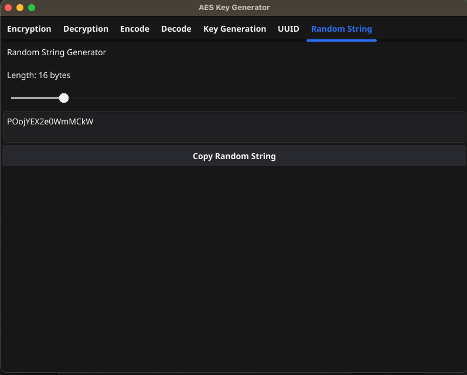

# Go Crypto Utils

## Maintainer: donghquinn

## What is Crypto Util?
* It's crypto utils written by golang.
* It must be quite bothering creating secure keys, or encoding strings just for test.
    * In my case, I felt lots of bothersome every single moment I had to encode request bodies or fields for API Encryption/Decryption test with base64 and AES / SHA / Etc...
    * Plus, Generating Random String on MacOs has been removed. I loved this one.
* This is a simple tool for generating keys or encoding strings

---

## Build
* Building Macos
    * Just build with the script I've uploaded when you are using macos
    * I'm using mac m2 apple silicon
* Building Windows 64bit
    * Building Windows cross-platform on macos, You need to configure C Compilers
    * Follow this step; I've utilized homebrew to install mingw-w64, which is windows cross-compliers
    * Then set enviroment variables for cross-compilation

```bash
brew install mingw-w64
```

```bash
export GOOS=windows
export GOARCH=amd64
export CGO_ENABLED=1
export CC=x86_64-w64-mingw32-gcc
```

### Useing Makefile
* Building Env

```bash
export GOOS=windows
export GOARCH=amd64
export CGO_ENABLED=1
export CC=x86_64-w64-mingw32-gcc
```

* Install fyne/v2 on local host

```bash
    go install fyne.io/fyne/v2/cmd/fyne@latest
```


---

## Provide
* Encrypt

    * AES-CBC
    * AES-GCM
    * SHA-256 (Upcoming)
    * SHA-512 (Upcoming)

* Decrypt

    * AES-CBC
    * AES-GCM
    * SHA-256 (Upcoming)
    * SHA-512 (Upcoming)
    
* Encode

    * Base64
    * Hex

* Decode

    * Base64
    * Hex

* Generate AES Key


* Generate UUID


* Generate Random String
