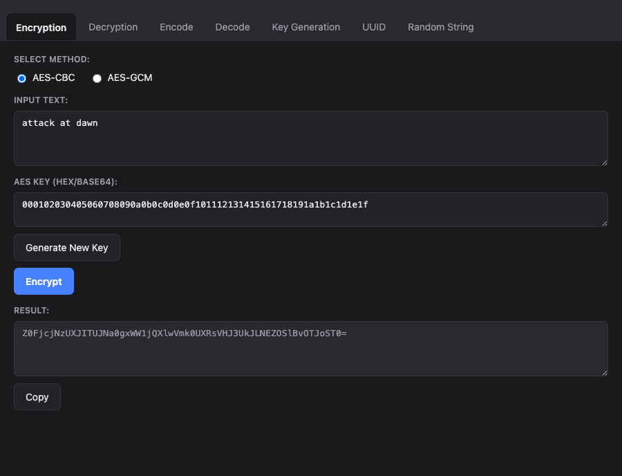
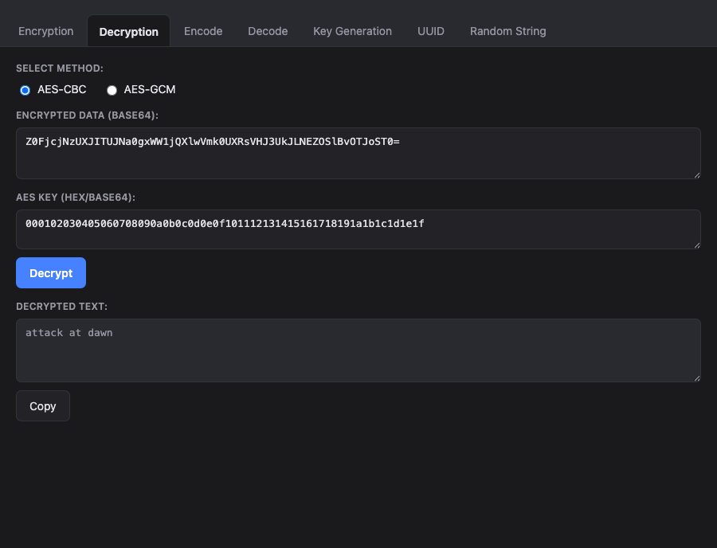
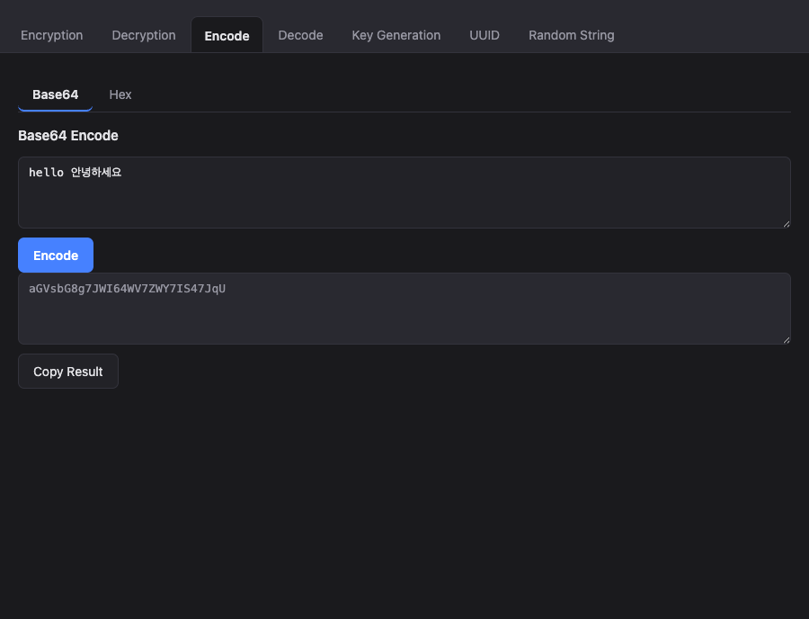
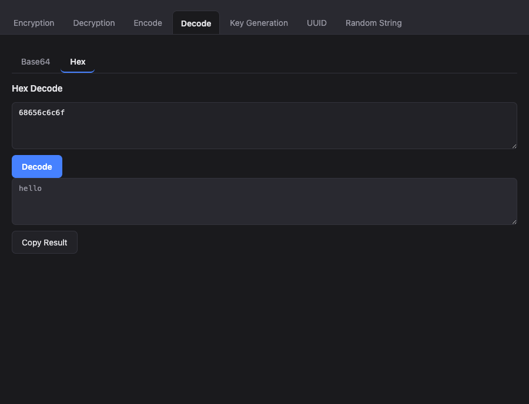
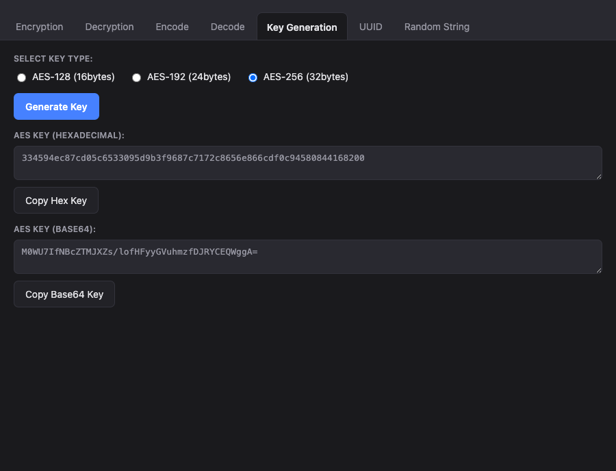
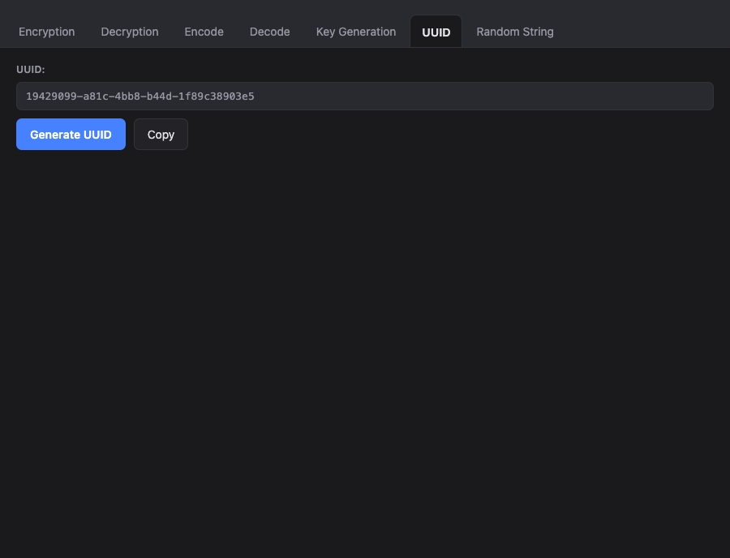
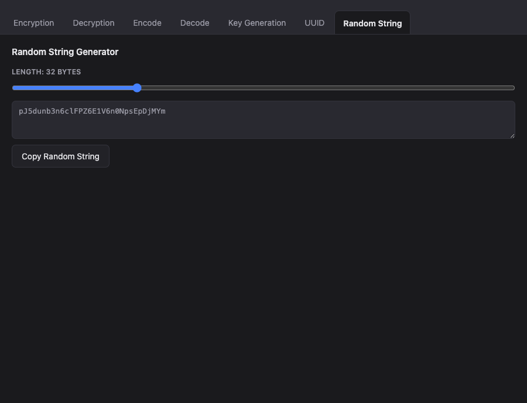

# Secure Helper

A cross-platform desktop app for everyday cryptographic chores — AES
encryption/decryption, Base64 and Hex encoding, AES key generation, UUIDs and
random strings. No command line, no throwaway scripts.

**Maintainer:** donghquinn

Built with Electron. The original Go/Fyne implementation is archived under
[`legacy/go/`](legacy/go/README.md).

## Features

- **Encryption / Decryption** — AES-CBC and AES-GCM (128/192/256-bit keys)
- **Encoding / Decoding** — Base64 and Hexadecimal
- **Key Generation** — AES-128, AES-192, AES-256, shown in Hex and Base64
- **UUID Generation** — RFC 4122 v4
- **Random Strings** — 1–128 characters, `[a-zA-Z0-9]`
- **Cross-platform** — macOS, Windows and Linux installers from one build host

All cryptography runs in the main process on Node's `node:crypto`; nothing
leaves the machine and the app makes no network requests.

## Requirements

- Node.js 20+ and npm (development only — end users just run the installer)

## Development

```bash
npm install
npm start     # launch the app
npm test      # unit tests for the crypto and operations layers
```

## Building installers

```bash
npm run dist          # macOS + Windows + Linux
npm run dist:mac      # .dmg and .zip        (x64, arm64)
npm run dist:win      # NSIS setup, portable (x64, arm64)
npm run dist:linux    # AppImage, .deb, .tar.gz (x64, arm64)
```

Artifacts land in `dist/`. All three platforms build from macOS — no MinGW,
Wine or Docker needed. CI (`.github/workflows/build.yml`) also builds each
platform on its native runner and, on a `v*` tag, attaches the artifacts to a
GitHub release *and* uploads them to Cloudflare R2 for the download site.

### Code signing

Builds are unsigned. macOS users get a Gatekeeper warning on first launch
(right-click → Open, or `xattr -dr com.apple.quarantine "/Applications/Secure Helper.app"`);
Windows shows a SmartScreen prompt. To sign, set `mac.identity` in
`electron-builder.yml` and provide `CSC_LINK` / `CSC_KEY_PASSWORD` (plus
`APPLE_ID`, `APPLE_APP_SPECIFIC_PASSWORD`, `APPLE_TEAM_ID` for notarization).

## Release and hosting

Pushing a `v*` tag runs the full pipeline in `.github/workflows/build.yml`:
tests, a native build per platform, a GitHub release, then an upload to R2.

### R2 configuration

Set these once under **Settings → Secrets and variables → Actions**:

| Kind | Name | Value |
| --- | --- | --- |
| Secret | `R2_ACCOUNT_ID` | Cloudflare account ID |
| Secret | `R2_ACCESS_KEY_ID` | R2 API token key ID |
| Secret | `R2_SECRET_ACCESS_KEY` | R2 API token secret |
| Secret | `R2_BUCKET` | Bucket name |
| Variable | `R2_PUBLIC_BASE_URL` | Public base URL, no trailing slash |

The bucket needs a public base URL (an `r2.dev` domain or a custom one) and a
CORS rule allowing `GET` from the Pages origin, so the site can read the
release manifest. Objects land under a versioned prefix:

```
v2.0.0/Secure Helper-2.0.0-arm64.dmg    # and every other installer
v2.0.0/SHA256SUMS.txt
v2.0.0/manifest.json                    # immutable copy
latest.json                             # the one mutable object; site polls it
```

Everything under `v<version>/` is immutable and cached for a year;
`latest.json` gets a five-minute TTL. `scripts/build-manifest.mjs` produces the
manifest — it classifies each artifact by filename into platform, architecture
and kind.

The R2 upload runs *after* the GitHub release, which stays the canonical copy;
R2 is the mirror the download links point at. `SHA256SUMS.txt` is attached to
the release as well.

### Download site

`site/` is a static page deployed to GitHub Pages by
`.github/workflows/site.yml`. Enable it once under **Settings → Pages →
Source: GitHub Actions**.

The workflow copies `screenshots/` and `build/icon.png` into `site/assets/`
(generated, and git-ignored) and substitutes `__VERSION__` and
`__DOWNLOAD_BASE__` in `index.html`. At runtime the page fetches
`latest.json` from R2 and rebuilds its download list from it, so a new
release appears without redeploying; the version baked in at deploy time is the
fallback when that fetch fails. The R2 upload step triggers a redeploy on its
way out.

To preview locally:

```bash
mkdir -p site/assets/screenshots && cp screenshots/*.png site/assets/screenshots/
cp build/icon.png site/assets/icon.png
sed -e 's|__VERSION__|2.0.0|g' -e 's|__DOWNLOAD_BASE__|https://dl.example.com|g' \
  site/index.html > site/preview.html
python3 -m http.server -d site 8000
```

## Usage

| Tab | What it does |
| --- | --- |
| Encryption | Encrypt text with AES-CBC or AES-GCM; generate a key inline |
| Decryption | Decrypt Base64 ciphertext with the matching key |
| Encode | Text → Base64 or Hex |
| Decode | Base64 or Hex → text |
| Key Generation | Random AES-128/192/256 key, in Hex and Base64 |
| UUID | Generate a v4 UUID |
| Random String | Alphanumeric string, length set by a slider |

Keys are accepted as Hexadecimal or Base64. The input is tried as Hex first and
falls back to Base64, matching the previous build.

## Compatibility with the Go build

Ciphertext written by the Go/Fyne version decrypts here, and vice versa. This
was verified both directions against the original `biz` package across AES-128,
AES-192 and AES-256 with Hex and Base64 keys.

Two details are carried over deliberately:

- **AES-CBC output is Base64-encoded twice.** `EncryptAES256CBC` returned a
  Base64 string, and the old Encryption tab Base64-encoded it again; the
  Decryption tab undid both layers. Changing it would break existing
  ciphertext, so the format is preserved.
- **AES-GCM output is Base64-encoded once**, over `nonce || ciphertext || tag`.

One behaviour was **not** carried over: the old Encryption tab discarded the
error from `EncryptAES256CBC`, so an invalid key silently produced an empty
result. Errors now surface in the UI.

## Project structure

```
├── src/
│   ├── main/
│   │   ├── main.js          # app lifecycle, window, menu
│   │   ├── ipc.js           # IPC handler registration
│   │   ├── operations.js    # tab-level operations (port of gui/)
│   │   └── crypto.js        # AES, PKCS#7, keys, UUID, random (port of biz/)
│   ├── preload/preload.js   # contextBridge API over a fixed channel list
│   └── renderer/            # index.html, styles.css, renderer.js
├── test/crypto.test.js
├── site/                    # download site deployed to GitHub Pages
├── scripts/build-manifest.mjs   # release manifest consumed by the site
├── build/icon.png           # 1024×1024 source for every platform icon
├── electron-builder.yml
├── legacy/go/               # archived Go/Fyne implementation
└── screenshots/
```

### Security posture

`contextIsolation` and `sandbox` are on, `nodeIntegration` is off, the renderer
has a restrictive CSP, navigation and new windows are blocked, and the preload
exposes only a fixed list of IPC channels. The renderer never touches key
material beyond passing it through to the main process.

## Screenshots









## License

See [LICENSE](LICENSE).
